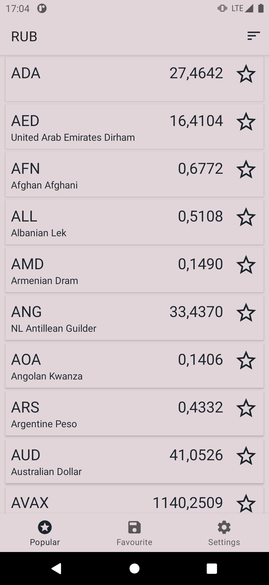
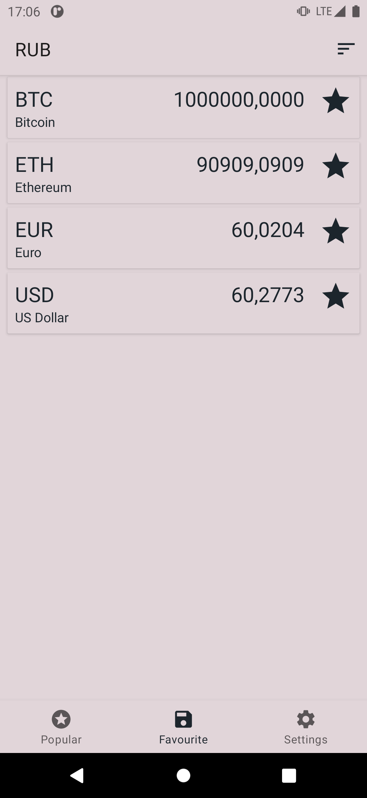

# Currency app

| Popular | Favourite | Settings |
|-|-|-|
|  |  |  |

Simple currency app which uses [currencyapi](https://currencyapi.com/docs/latest) to fetch data.

App's architecture is inspired by by Chris Banes' [Tivi app](https://github.com/chrisbanes/tivi). The app uses the following frameworks:
- [Room](https://developer.android.com/jetpack/androidx/releases/room)
- [Dagger Hilt](https://dagger.dev/hilt/)
- [Arrow](https://arrow-kt.io/docs/core/)
- [Moshi](https://github.com/square/moshi)
- [DataStore](https://developer.android.com/jetpack/androidx/releases/datastore)
- [Coroutines](https://kotlinlang.org/docs/coroutines-overview.html)
- [Navigation component](https://developer.android.com/guide/navigation/navigation-getting-started)
- [Retrofit](https://square.github.io/retrofit/)
